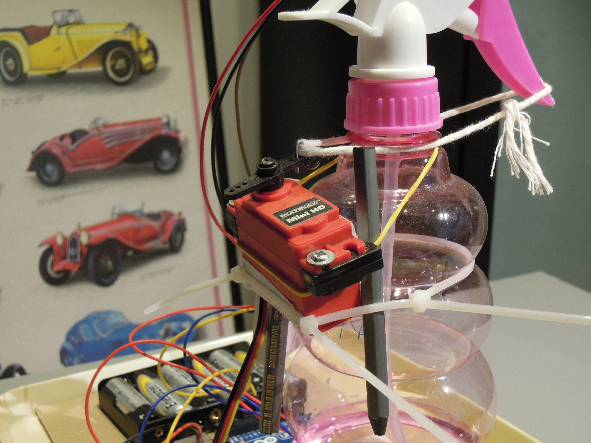

# Aleksander
Aleksander jest to automatyczny, bezdotykowy dyspenser alkoholu.

## Motyw
Jako że znaleźliśmy się w środku epidemii, higiena stanowi priorytet. W związku z tym moje mieszkanie wypełniło się sprayami do dezynfekcji. Choć ich obsługa jest łatwa i intuicyjna, wymaga kontaktu zakażonych rąk z urządzeniem. W rezultacie może dojść do sytuacji, gdzie ktoś będzie miał na dłoniach wirusa tylko dlatego, że chciał zapewnić sobie jego brak! Będąc znudzonym i społecznie odizolowanym postanowiłem rozwiązać ten problem przy użyciu urządzeń i narzędzi, które miałem pod ręką. A należały do nich:
- Servo Multiplex Mini HD
- Arduino UNO R3
- Sensor odległości na podczerwień
- Jumpery i płytka prototypowa
- Jakieś połamane ołówki, taśma klejąca i sznur
- Spray zawierający roztwór etanolu

## Efekt???

Piękno to kwestia względna, ale mi osobiście Aleksander się podoba.

## Działanie

A jak wygląda w akcji? Zobaczcie sami:

[Film poprawnego działania](https://youtu.be/_JaegOjjDDQ)

Działanie jest szybkie i sprawne; Aleksander każdorazowo podaje szczodrą ilość alkoholu, zgodnie ze specyfikacją. W niektórych warunkach bywa jednak nieco zbyt hojny...

[Film niepoprawnego działania](https://youtu.be/lJuU_BZAH7c)

Przeanalizujmy zjawisko. Mamy do czynienia z takim sensorem:

Posiada on dwie diody: jedna emituje podczerwień, a druga rejestruje. Gdy jakiś obiekt jest blisko sensora, światło emitowane przez diodę odbija się z powrotem w jej stronę. Im bliżej znajduje się obiekt, tym większe jest natężenie odbitego światła. Powyżej pewnej granicy sensor wykrywa dostateczną ilość odbitego promieniowania i aktywuje się.

W zacienionym pomieszczeniu system działa prawidłowo, jednak przy silnych zakłóceniach takich jak Słońce, sensor może się aktywować pomimo braku obiektów w jego zasięgu. Zresztą, nie trzeba Słońca; udało mi się go nawet aktywować celując w niego pilotem od telewizora i naciskając przyciski z odległości metra.

Ale wieczorami działa świetnie!

## Program
Program jest napisany w środowisku Arduino. Kod znajduje się [tutaj](Program/aleksander/aleksander.ino).

Sensor oraz serwo podłączone są do linii 5V i GND Arduino. Serwo kontrolowane jest za pomocą sygnału PWM z pinu 9 mikrokontrolera, a sygnał sensora odbiera pin 12. Gdy sensor się aktywuje, jego sygnał przyjmuje stan niski. Program wtedy skręca serwo przy pomocy funkcji `squeeze`, czeka 200ms, aby serwo miało czas uporać się z pociągnięciem spustu, a następnie funkcja `relax` powoduje powrót serwa na miejsce początkowe. Następnie program czeka 400ms, abyśmy mieli czas zabrać naszą zdezynfekowaną rękę i uniknąć nieproszonej dolewki.

## Podsumowanie
W czasach, gdy zachowanie higieny jest ważniejsze niż kiedykolwiek, Aleksander przychodzi z pomocą. Może nie jest on najbardziej niezawodnym urządzeniem, albo najbardziej kompaktowym, ale niewątpliwie urokliwym. Jego udoskonalenie wiązałoby się z bardziej ergonomiczną budową i trwalszym montażem komponentów, a także innym sensorem, odpornym na świetlne zakłócenia.
